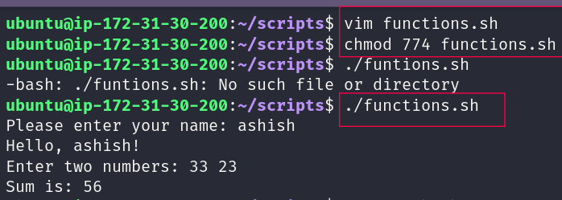
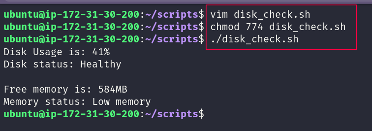
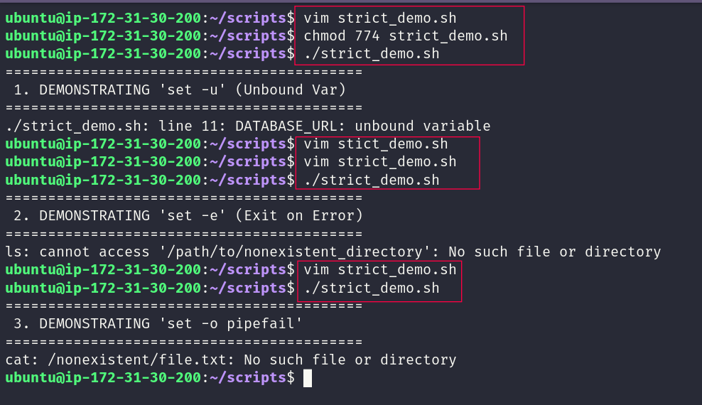
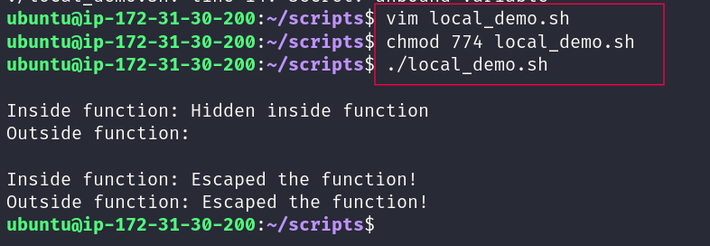
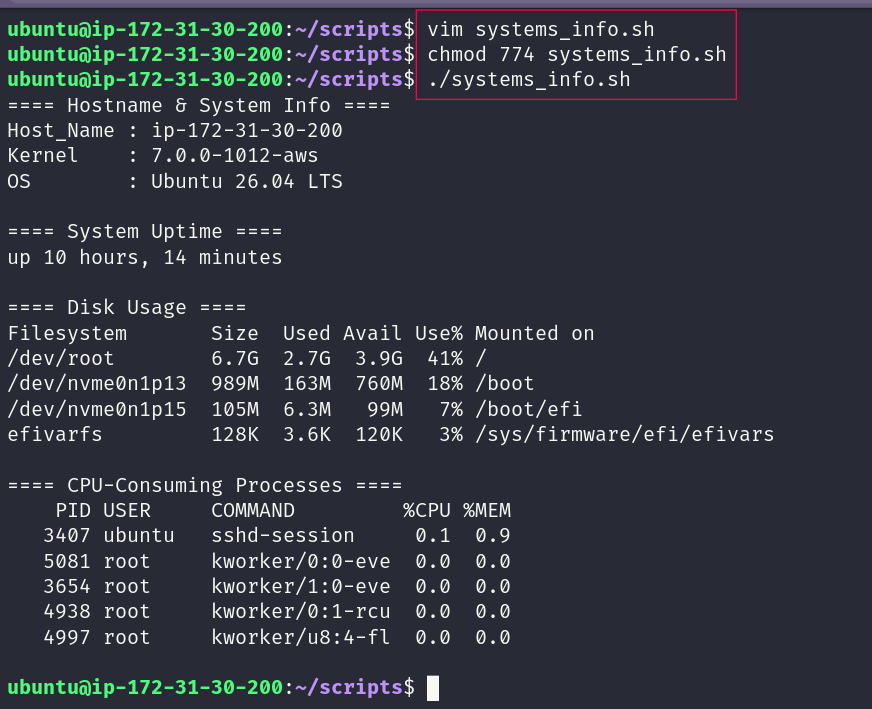

# Day 18: Shell Scripting: Functions and Intermediate Concepts

> **#90DaysOfDevOps | Bash practice**

Day 18 was a step beyond basic shell scripting.

Instead of keeping everything in one block of commands, I started thinking about **reusability, scope, failure handling, and structure**. I practiced functions, return statuses, strict mode, local variables, and finished with a small system information script.

The goal was simple: write scripts that are easier to understand today and easier to maintain later.

---

## Day 18 

| Area | What I practiced | Script |
|---|---|---|
| Functions | Create functions, pass arguments, reuse logic | `functions.sh` |
| Return status | Use function results in decisions | `disk_checks.sh` |
| Strict mode | `set -euo pipefail` | `stricts_demo.sh` |
| Variable scope | Compare `local` and regular variables | `local_demo.sh` |
| Practical scripting | Combine functions into one utility | `systems_info.sh` |

Scripts: [`scripts/`](scripts/)  
Screenshots: [`images/`](images/)

---

# 1. Functions

### Script: `functions.sh`

I started by creating two simple functions:

- `greet`: receives a name and prints a greeting.
- `add`: receives two numbers and calculates their sum.

The useful part here was not the calculation itself. It was seeing how a script can be broken into small pieces with clear responsibilities.

Instead of repeating the same commands, I can call a function whenever that operation is needed.

### Screenshot



### What I learned

A function gives a block of Bash code a name and a purpose. That makes a script easier to read and gives me a simple way to reuse logic.

---

# 2. Function Return Status

### Script: `disk_checks.sh`

This task moved from basic functions to something more practical.

The script checks:

- disk usage of `/`
- available memory
- the result of each check

The functions use their return status to tell the main part of the script whether the check passed or failed.

For example:

```bash
return 0
```

can represent success, while:

```bash
return 1
```

can represent failure.

That result can then be used directly in a condition:

```bash
if check_disk; then
    ...
else
    ...
fi
```

### Screenshot



### What I learned

In Bash, a function does not have to only print something. It can also return a status that the rest of the script can use to make a decision.

---

# 3. Strict Mode: `set -euo pipefail`

### Script: `stricts_demo.sh`

This was the part I found most useful because it showed how Bash behaves when something goes wrong.

I used:

```bash
set -euo pipefail
```

and tested each option separately.

## `-e` Stop on an unhandled error

With `set -e`, the script can stop when a command returns a non-zero status instead of blindly continuing.

My test used a command that tried to access something that did not exist. The script stopped before reaching the following statement.

## `-u`  Catch unset variables

With `set -u`, using a variable that has not been defined is treated as an error.

Example:

```bash
echo "${DATABASE_URL}"
```

If `DATABASE_URL` does not exist, Bash reports the problem instead of silently treating it as an empty value.

## `pipefail` Do not hide pipeline failures

A pipeline can contain several commands:

```bash
command1 | command2 | command3
```

Without `pipefail`, an earlier failure can be hidden when the last command succeeds.

With:

```bash
set -o pipefail
```

the pipeline can report the earlier failure as well.

### Quick Reference

| Option | Purpose |
|---|---|
| `set -e` | Stop after an unhandled command failure |
| `set -u` | Treat unset variables as errors |
| `set -o pipefail` | Preserve failures inside pipelines |

### Screenshot



### What I learned

`set -euo pipefail` is not magic protection for every possible problem, but it is a strong starting point for writing Bash scripts that fail more visibly and predictably.

---

# 4. Local Variables

### Script: `local_demo.sh`

This task was about **scope**.

I compared a variable created with:

```bash
local secret="Hidden inside function"
```

with a regular variable:

```bash
leaked="Escaped the function!"
```

The local variable is limited to the function where it is created.

The regular variable can remain available after the function finishes.

### Screenshot



### What I learned

Using `local` helps keep a function's internal values private to that function. That reduces the chance of one part of a script accidentally changing a variable used somewhere else.

---

# 5. System Information Reporter

### Script: `systems_info.sh`

For the final task, I brought the earlier ideas together.

The script uses functions to report useful system information, including:

- hostname and operating system
- system uptime
- disk usage
- CPU-consuming processes

A `main` function controls the order in which the sections are displayed.

The script also starts with:

```bash
set -euo pipefail
```

so the same strict-mode approach is used in a more realistic script.

### Screenshot



# What I Learned Today

### 1. Functions make scripts easier to maintain

Breaking work into named functions makes a script easier to read, reuse, and change.

### 2. Return status is useful for decision making

A function can report success or failure, and the caller can use that result in an `if` condition or another control structure.

### 3. Scope and strict mode help prevent subtle problems

`local` keeps function variables contained, while `set -euo pipefail` helps expose several common failure cases earlier.

---

# My Takeaway

The biggest difference I noticed today was in **how I think about a script**.

Earlier, I was mainly focused on making the commands work.

Today, I started asking better questions:

**Can I reuse this?**  
**What happens when it fails?**  
**Can this function affect something outside itself?**  
**Can I turn several commands into one small utility?**

That shift makes Bash feel much more like a real programming tool and much less like a place to collect commands.

**Day 18 Completed ✅**

---

## Repository

- 📁 [Day 18](.)
- 📜 [Scripts](scripts/)
- 🖼️ [Screenshots](images/)

**#90DaysOfDevOps #DevOps #Linux #Bash #ShellScripting #Automation #DevOpsKaJosh #TrainWithShubham**
