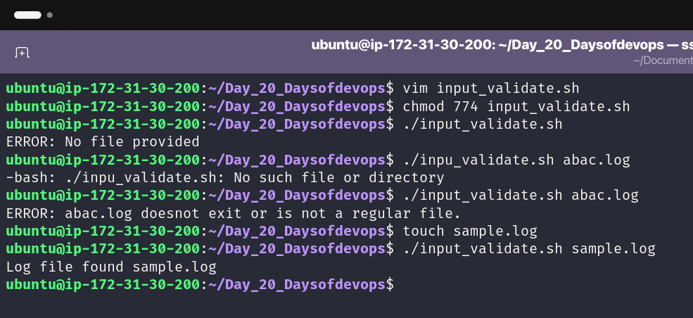
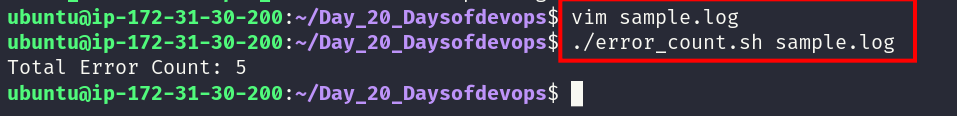
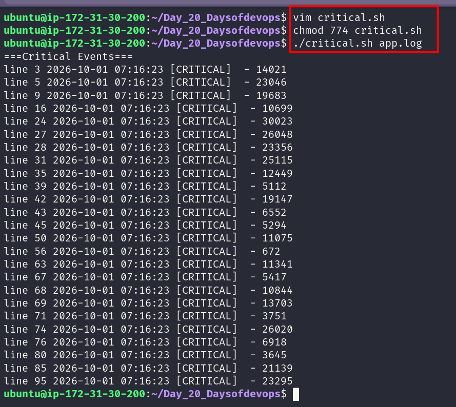
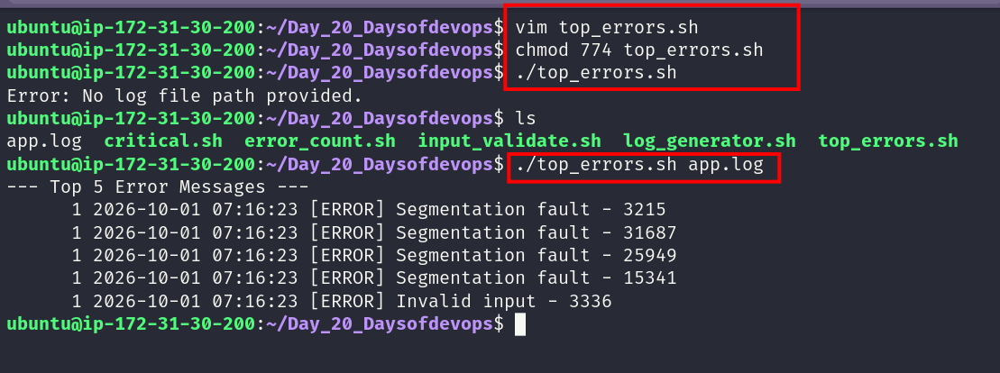
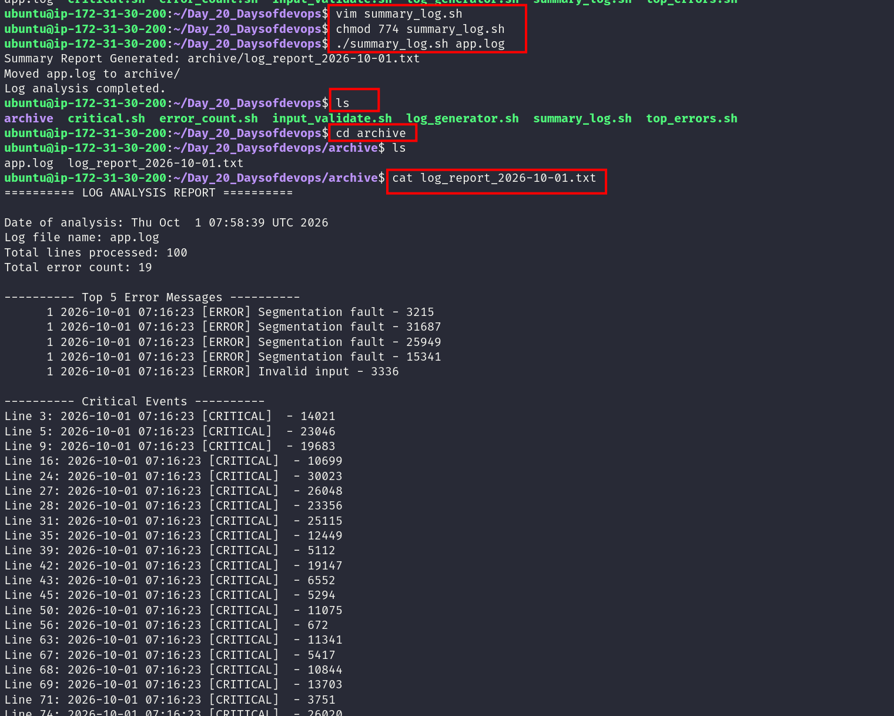

# Day 20 – Bash Scripting Challenge: Log Analyzer & Report Generator

Today I worked on a small Bash project for analyzing log files.

The script takes a log file, checks it, looks for errors and critical events, finds repeated error entries, and creates a report. I also added an archive step to move the processed log after the analysis.

For testing, I used the log generator from this project to create sample log files.

---

## 🎯 Objectives

* Pass a log file to a Bash script
* Check whether the file exists
* Count `ERROR` and `Failed` entries
* Find `CRITICAL` events with line numbers
* Find the most common error entries
* Generate a dated summary report
* Move the processed log into an archive

---

## Task 1 – Input & Validation

I started by checking whether a log file was provided to the script.

```bash
if [ $# -eq 0 ]; then
	echo "No log file path Provided..."
	exit 1
fi
```

After that, the script checks whether the given path points to a file.

```bash
if [ ! -f "$log_file" ]; then
	echo "File does not exist: $log_file"
	exit 1
fi
```

This gives the script a simple way to handle missing or invalid input before doing the analysis.

### 📸 Screenshot

> 

---

## Task 2 – Error Count

Next, I checked the log file for `ERROR` and `Failed` entries.

```bash
total_error_count=$(grep -Eic "ERROR|Failed" "$log_file" || true)
```

I used `grep -E` so both patterns can be searched in the same command.

The count is stored in a variable and later added to the report.

Example:

```text
Total Error Count: 20
```

### 📸 Screenshot

> 

---

## Task 3 – Critical Events

For critical events, I searched for `CRITICAL`.

```bash
grep -n "CRITICAL" "$log_file"
```

The `-n` option shows the line number along with the matching log entry.

I also used a `while` loop with `IFS=:` to separate the line number from the rest of the log entry.

Example:

```text
Line 14: 2026-10-01 12:41:32 [CRITICAL]  - 18291
Line 47: 2026-10-01 12:42:05 [CRITICAL]  - 19273
```

### 📸 Screenshot

> 

---

## Task 4 – Top 5 Error Messages

For this part, I used a command pipeline:

```bash
grep -i "error" "$log_file" | sort | uniq -c | sort -nr | head -5
```

I used each command for a different step:

```text
grep      → find error entries
sort      → arrange matching lines
uniq -c   → count repeated lines
sort -nr  → sort by the count
head -5   → show the first five
```

This made it easier to see which error entries were repeated the most.

Example:

```text
--- Top 5 Error Messages ---
8  2026-10-01 12:40:16 [ERROR] Disk full - 9123
7  2026-10-01 12:40:22 [ERROR] Failed to connect - 7318
6  2026-10-01 12:40:29 [ERROR] Out of memory - 5831
5  2026-10-01 12:40:35 [ERROR] Invalid input - 4421
4  2026-10-01 12:40:41 [ERROR] Segmentation fault - 2191
```

### 📸 Screenshot

> 

---

## Task 5 – Summary Report

Once the analysis is finished, the results are written into a report file.

The report filename is created using the current date:

```bash
report_file="archive/log_report_$(date +%F).txt"
```

For example:

```text
archive/log_report_2026-10-01.txt
```

The report contains:

* Date of analysis
* Log file name
* Total lines processed
* Total error count
* Top 5 error entries
* Critical events with line numbers

The report is written into the `archive` directory.

### 📸 Screenshot

> 

---

## Task 6 – Archive Processed Logs

I also included the optional archive part.

First, the script creates the directory if it is not already there:

```bash
mkdir -p archive
```

After the report is generated, the processed log is moved into it:

```bash
mv "$log_file" archive/
```

The script then prints a confirmation message.

Example:

```text
Summary Report Generated: archive/log_report_2026-10-01.txt
Moved logs/app.log to archive/
Log analysis completed.
```

---
## 🛠️ Commands I Used

During this challenge, I worked with:

* `grep`
* `wc`
* `sort`
* `uniq`
* `head`
* `date`
* `mkdir`
* `mv`
* Bash variables
* Pipes (`|`)

I mainly used these commands together to search the log and turn the results into a report.

---

## 🧠 What I Learned

Through this challenge, I got more practice with:

* Passing file paths to Bash scripts
* Checking user input and validating files
* Searching logs with `grep`
* Counting matching log entries
* Finding `CRITICAL` events with line numbers
* Using `sort`, `uniq`, and `head` together
* Storing command output in Bash variables
* Creating report filenames using `date`
* Writing command output into a text file
* Creating folders and moving files with `mkdir` and `mv`
* Combining Linux commands to build a simple log-analysis workflow

---

## 🚀 Final Outcome

This exercise helped me put several Bash and Linux commands together in one working script.

The final workflow can:

```text
✓ Check the log file
✓ Count errors
✓ Find critical events
✓ Find repeated error entries
✓ Generate a dated report
✓ Archive the processed log
```

It was a good hands-on exercise for getting more comfortable with Bash and Linux command-line tools.

**Day 20 completed ✅**

#90DaysOfDevOps #DevOpsKaJosh #TrainWithShubham
