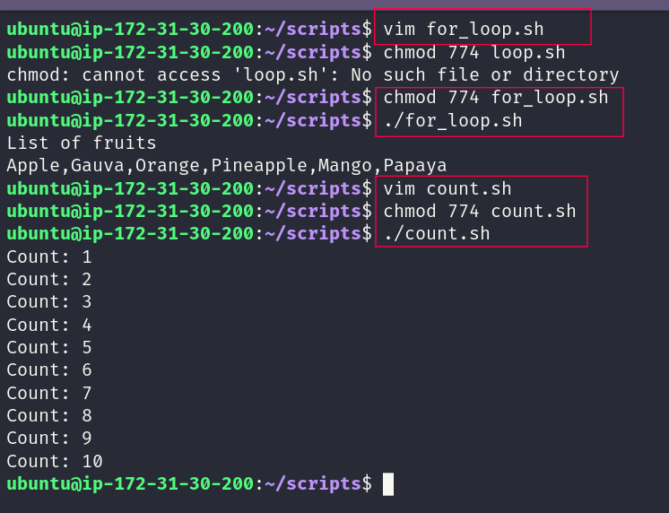
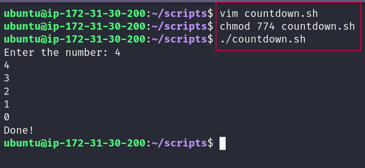
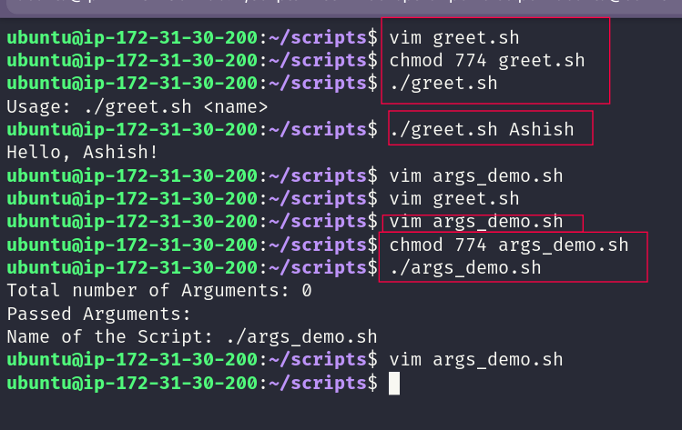
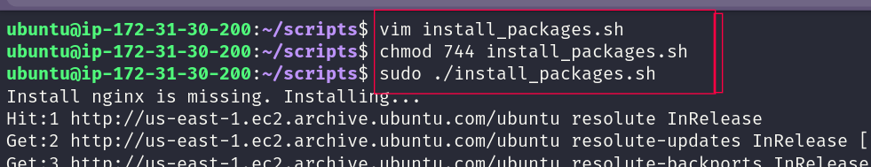
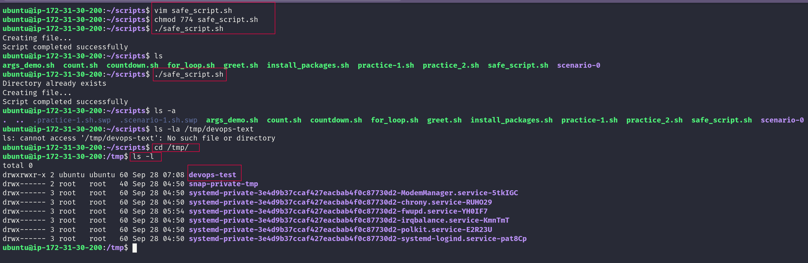

# Day 17: Shell Scripting: Loops Arguments and Error Handling

> **#90DaysOfDevOps | Bash practice on Ubuntu**

Day 17 was about making Bash do more of the repetitive work for me.

I practiced loops, command-line arguments, package installation, and basic error handling. I also ran the scripts on Ubuntu and captured the results along the way.

---

## What I Practiced

| Task | Focus | Scripts |
|---|---|---|
| 1 | `for` loops | `for_loop.sh`, `count.sh` |
| 2 | `while` loops | `countdown.sh` |
| 3 | Command-line arguments | `greet.sh`, `args_demo.sh` |
| 4 | Package automation | `install_packages.sh` |
| 5 | Error handling | `safe_script.sh` |

All scripts are kept in [`scripts/`](scripts/).

---

## 1. `for` Loops

### `for_loop.sh`

The script goes through a list of fruit names and prints them.

**Terminal result:**

```text
List of fruits
Apple,Gauva,Orange,Pineapple,Mango,Papaya
```

### `count.sh`

This script uses a numeric `for` loop to count from 1 to 10.

```text
Count: 1
Count: 2
Count: 3
Count: 4
Count: 5
Count: 6
Count: 7
Count: 8
Count: 9
Count: 10
```

### Screenshot



**Main idea:** use a `for` loop when the same work needs to be repeated for a known set of values.

---

## 2. `while` Loop

### `countdown.sh`

The script asks for a number and counts down to `0`.

I tested it with `4`:

```text
Enter the number: 4
4
3
2
1
0
Done!
```

### Screenshot



**Main idea:** a `while` loop keeps running while its condition is true.

---

## 3. Command-Line Arguments

### `greet.sh`

This script reads the first command-line argument with `$1`.

Without an argument:

```bash
./greet.sh
```

Output:

```text
Usage: ./greet.sh <name>
```

With an argument:

```bash
./greet.sh Ashish
```

Output:

```text
Hello, Ashish!
```

### `args_demo.sh`

This script shows the common Bash argument variables:

| Variable | Meaning |
|---|---|
| `$0` | Script name/path |
| `$1` | First argument |
| `$#` | Number of arguments |
| `$@` | All arguments |

I also tested it with no arguments:

```text
Total number of Arguments: 0
Passed Arguments:
Name of the Script: ./args_demo.sh
```

### Screenshot



**Main idea:** arguments let one script accept different input each time it runs.

---

## 4. Package Installation

### `install_packages.sh`

The script works with:

```text
nginx
curl
wget
```

For each package, it:

- checks whether it is already installed
- skips it when it is present
- installs it when it is missing
- shows the package status
- checks for root privileges before continuing

I ran it with:

```bash
sudo ./install_packages.sh
```

### Screenshot



**Main idea:** a repeated setup task can be turned into a script instead of being performed manually each time.

---

## 5. Error Handling

### `safe_script.sh`

This script works with:

```text
/tmp/devops-test
```

It creates the directory, enters it, and creates a file inside.

I also practiced:

```bash
set -e
```

and:

```bash
command || echo "Something went wrong"
```

When I ran the script again, the directory already existed. The script reported that condition and continued.

### Screenshot



**Main idea:** scripts should handle expected problems instead of assuming every command will always succeed.

---

## Bash Quick Reference

### Loops

```bash
for item in ...; do
    ...
done
```

```bash
while [ condition ]; do
    ...
done
```

### Arguments

```bash
$0   # script name
$1   # first argument
$#   # argument count
$@   # all arguments
```

### Error handling

```bash
set -e
```

```bash
command || echo "Error"
```

### Root check

```bash
if [ "$EUID" -ne 0 ]; then
    echo "Run as root"
    exit 1
fi
```

---

## What I Learned

### 1. Loops reduce repetitive work

Instead of writing the same command many times, I can let Bash repeat it for me.

### 2. Arguments make scripts reusable

The same script can work with different input without changing its code.

### 3. Automation needs safety checks

Permission checks and error handling make scripts more predictable when something is not as expected.

---

## My Takeaway

The biggest change for me today was moving from **running commands manually** to **thinking in repeatable automation**.

Loops handle repetition.

Arguments make scripts flexible.

Package checks remove manual steps.

Error handling helps the script deal with common problems.

These are small Bash building blocks, but they are starting to connect with the kind of automation I want to build in DevOps.

**Day 17 Completed ✅**

---

## Repository

- 📁 [Day 17](.)
- 📜 [Scripts](scripts/)
- 🖼️ [Screenshots](images/)

**#90DaysOfDevOps #DevOps #Linux #Bash #ShellScripting #Automation #DevOpsKaJosh #TrainWithShubham**
