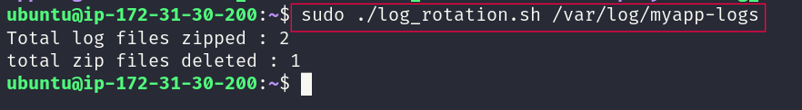
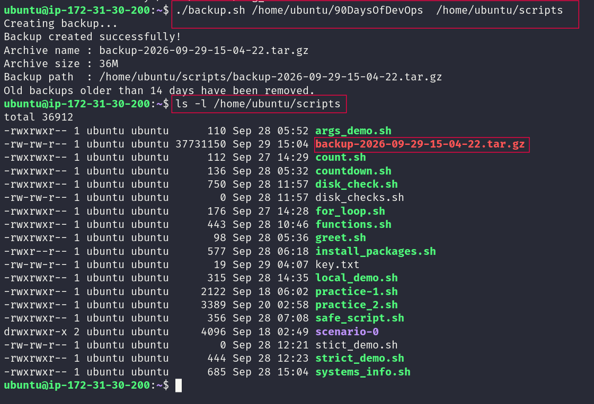
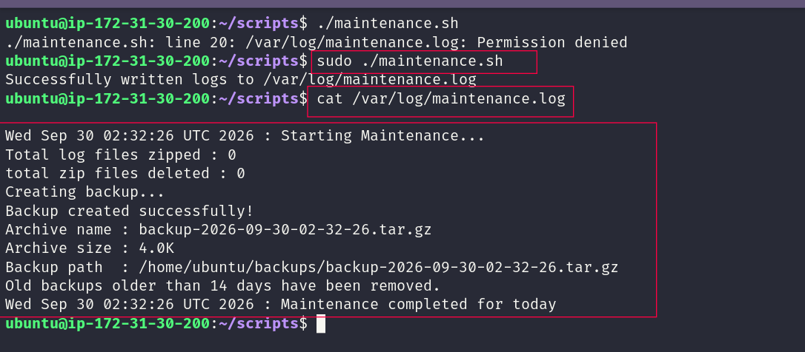

# Day 19: Shell Scripting Project

## Overview

Day 19 was about putting the Bash skills from the previous days into practice.

I worked on a few small tasks around common server maintenance work:

* Log rotation
* Server backups
* Cron scheduling
* A maintenance script to connect the tasks together

The main goal was to make these tasks repeatable instead of doing everything manually.

---

## Task 1: Log Rotation

I created `log_rotation.sh` to manage old log files.

The script takes a log directory as an argument, checks that the directory exists, and then works with log files based on their age.

It compresses older `.log` files and removes old compressed logs to help keep the log directory clean.

### What it does

* Takes the log directory as an argument
* Checks whether the directory exists
* Compresses `.log` files older than 7 days
* Removes `.gz` files older than 30 days
* Counts compressed and deleted files
* Stops with an error when the directory does not exist

### Script

```text
scripts/log_rotation.sh
```

### Example

```bash
./scripts/log_rotation.sh /home/ubuntu/app-logs
```

### Result



---

## Task 2: Server Backup

For the second task, I created `backup.sh`.

The script takes a source directory and a backup directory, then creates a compressed `.tar.gz` archive with a timestamp.

I also added checks so the backup process stops when the source directory is missing.

### What it does

* Accepts source and backup directories as arguments
* Checks that the source directory exists
* Creates the backup directory when needed
* Creates a timestamped `.tar.gz` archive
* Checks that the archive was created
* Shows the archive name and size
* Removes backups older than 14 days

### Script

```text
scripts/backup.sh
```

### Example

```bash
./scripts/backup.sh /home/ubuntu/project /home/ubuntu/backups
```

### Result



---

## Task 3: Crontab

I used `crontab -l` to check the cron jobs already configured for the user.

I also practiced reading the five cron fields:

```text
* * * * * command
│ │ │ │ │
│ │ │ │ └── Day of week
│ │ │ └──── Month
│ │ └────── Day of month
│ └──────── Hour
└────────── Minute
```

### Cron entries

#### Log rotation at 2 AM every day

```cron
0 2 * * * /path/to/log_rotation.sh /var/log/myapp
```

#### Backup at 3 AM every Sunday

```cron
0 3 * * 0 /path/to/backup.sh /path/to/source /path/to/backups
```

#### Health check every 5 minutes

```cron
*/5 * * * * /path/to/health_check.sh
```

These entries were written for practice and documentation.

---

## Task 4: Maintenance Script

For the final task, I created `maintenance.sh`.

The purpose of this script is to bring the maintenance work into one place. It runs the log rotation and backup tasks and saves their output to:

```text
/var/log/maintenance.log
```

### What it does

* Runs the log rotation task
* Runs the backup task
* Writes output to the maintenance log
* Adds timestamps to the log
* Can be scheduled with cron

### Script

```text
scripts/maintenance.sh
```

### Daily cron entry

```cron
0 1 * * * /path/to/maintenance.sh
```

This runs the maintenance script every day at 1 AM.

### Result



---

## Scripts Used

```text
2026/day-19/
├── README.md
├── images/
│   ├── task_1.png
│   ├── task_2.png
│   └── task_4.png
└── scripts/
    ├── log_rotation.sh
    ├── backup.sh
    └── maintenance.sh
```

---

## What I Learned

### 1. Bash scripts can handle real maintenance tasks

Using commands such as `find`, `gzip`, and `tar` together made the scripts much more useful than running each command separately.

### 2. Error handling matters

Checking directories, verifying the backup, and using exit codes helps prevent the scripts from continuing when something goes wrong.

### 3. Cron makes repetitive work easier

Once a script is working properly, cron can run it at a fixed time without needing to start it manually.

---

## Day 19 Completed 🚀

This project helped me connect the Bash concepts from the previous days with practical server tasks.

I now have a better understanding of how **Shell Scripting, Linux commands, and Cron** can work together to automate routine maintenance.

#90DaysOfDevOps #DevOpsKaJosh #TrainWithShubham
